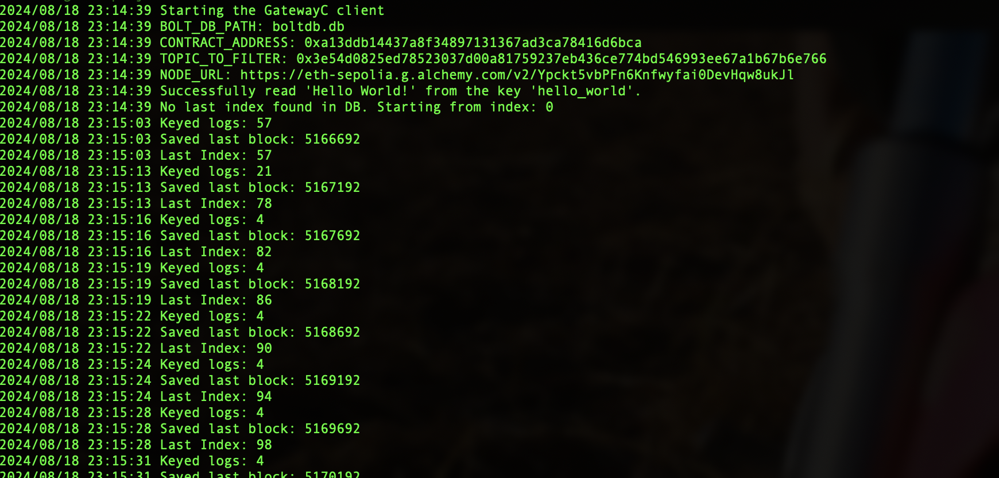
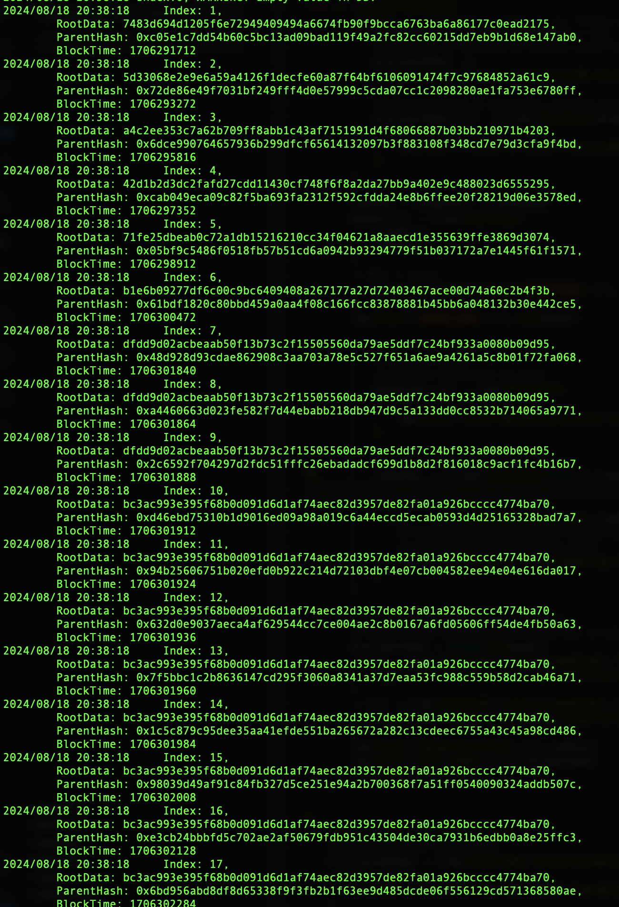
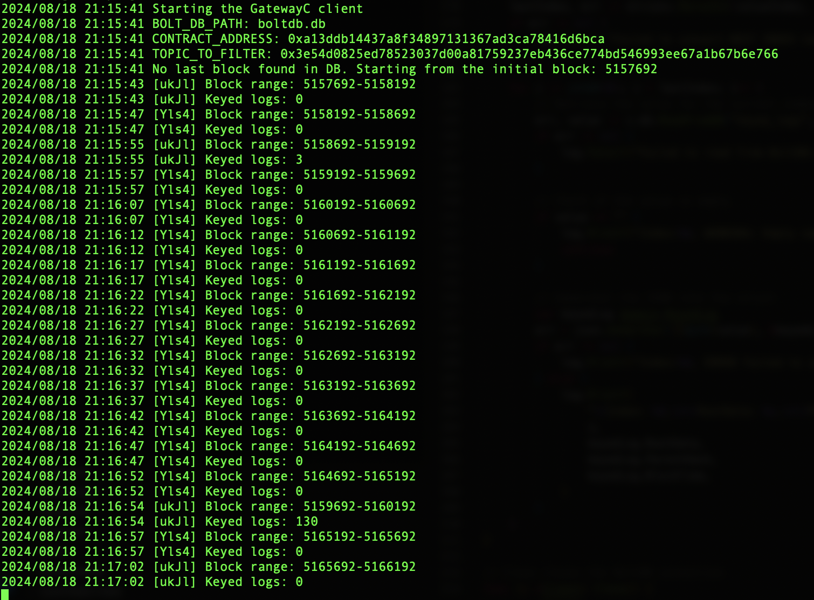

# Indexer

To see screenshots of how it works, just scroll down the README.md.

This is a simple implementation of an indexer that indexes topic X of contract Y on the Sepolia chain.

For the second challenge, check the branch "second".

YOU HAVE TO HAVE A LIST OF NODES , as list_nodex.txt and those should be the URLS of them.

## Pre-Requisites & Installation

- Go (Version: `go1.22.1`)
- GNU Make

### Installing GNU Make:

For macOS:

```bash
brew install make
```

For Red Hat, Fedora, or CentOS:

```bash
sudo dnf install make
# Or for older versions:
sudo yum install make
```

For Debian-based systems:

```bash
sudo apt update
sudo apt install make
```

You will need Docker to execute everything.

## Execution

### Using Docker

To run with Docker (so you don't need to install dependencies manually):

```bash
make docker
make run
```

If Docker is already built and there are no code changes, simply run:

```bash
make rund
make run
```

To stop the running code and check if anything has been written to the database, execute:

```bash
go run cmd/read.go
```

To see screenshots of how it works, just scroll down the README.md.

## Example of Code Execution

### Running the Go Binary:


Here’s a screenshot of the code running from scratch:



### Reading the Data:



Screenshot of the code running on challenge 2, with 2 urls, using a mask to not show full url, due to posting this image on the internet.




## Comments

If the code fails, it will crash with a fatal error. Future improvements could include removing the fatal error handling and adding retry mechanisms, among other enhancements, to ensure the code can run continuously. However, this is currently out of scope and will not be implemented.
